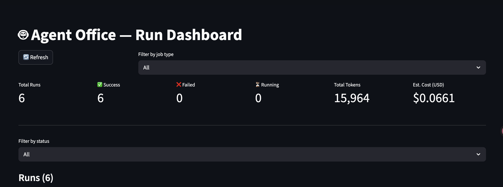
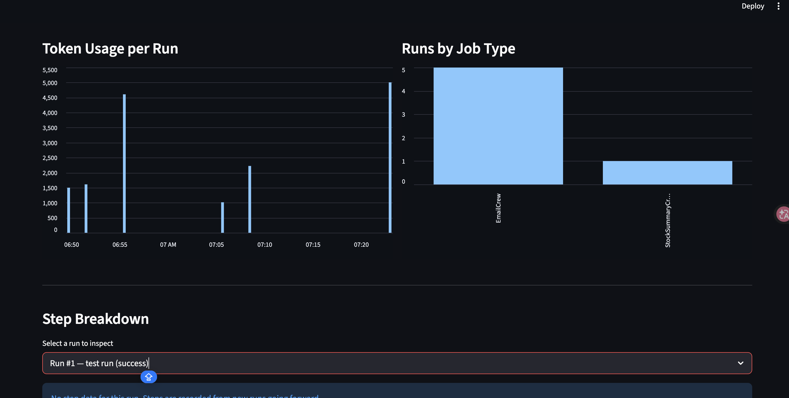

# Agent Office System

Multi-agent office automation built on **CrewAI**, **OpenAI GPT-4o**, and **Gmail**. Managed with **uv** (Python). All runs are tracked in SQLite and visible in a Streamlit dashboard.


<p align="center"></p>
<p align="center"></p>


---

## Architecture

```
┌──────────────────────────────────────────────────────────────────┐
│                        main.py (CLI)                             │
│   email │ summarize │ stock │ scheduler │ ui  subcommands        │
└───┬─────────┬──────────┬──────────┬──────────┬───────────────────┘
    │         │          │          │          │
    ▼         ▼          ▼          ▼          ▼
EmailCrew  DocSummary  StockSummary  Scheduler  Streamlit
           Crew        Crew          Crew       Dashboard
    │         │          │          │
    └────┬────┘          │     APScheduler
         │               │     + schedule.yaml
         ▼               ▼
   CrewAI Agents
┌──────────────────────────────────────────────────┐
│ Gmail Email Assistant  │ GmailSendTool            │
│                        │ GmailReadTool            │
├──────────────────────────────────────────────────┤
│ Document Analyst       │ DocReaderTool            │
│                        │ GmailSendTool            │
├──────────────────────────────────────────────────┤
│ US Stock Analyst       │ StockDataTool (yfinance) │
│                        │ GmailSendTool            │
└──────────────────────────────────────────────────┘
         │
         ▼
   LLM: OpenAI GPT-4o
         │
         ▼
┌──────────────────────────────────────────────────┐
│ SQLite  runs.db  (token cost, status, timing)    │
└──────────────────────────────────────────────────┘
```

**EmailCrew** — agent drafts body from natural language intent, sends via Gmail SMTP.

**DocSummaryCrew** — doc agent reads PDF/DOCX/TXT → structured summary → email agent sends it.

**StockSummaryCrew** — stock agent fetches live data via yfinance, produces Buy/Hold/Sell analysis per ticker → email agent sends the investment summary.

**SchedulerCrew** — loads `config/schedule.yaml` on startup, registers APScheduler cron jobs (`coalesce=True`, `max_instances=1`), dispatches to any crew on each tick.

**Run tracking** — every `crew.kickoff()` is wrapped by `tracker.py`: records name, job type, agents, status, token counts, and estimated GPT-4o cost into `runs.db`.

---

## Key Functions

| Module | Class / Function | What it does |
|---|---|---|
| `crews/email_crew.py` | `EmailCrew.run(to, subject, intent, attachments?)` | Draft + send a Gmail email, optionally with file attachments |
| `crews/doc_summary_crew.py` | `DocSummaryCrew.run(doc_path, recipients, notes?)` | Summarize a document and email the result |
| `crews/stock_summary_crew.py` | `StockSummaryCrew.run(tickers, recipients)` | Analyze US stocks and email an investment summary |
| `crews/scheduler_crew.py` | `SchedulerCrew.start()` | Load `schedule.yaml` and start background cron jobs |
| `tools/gmail_tool.py` | `GmailSendTool` | Send email via Gmail SMTP (supports attachments) |
| `tools/gmail_tool.py` | `GmailReadTool` | Read inbox messages via Gmail IMAP |
| `tools/stock_tool.py` | `StockDataTool` | Fetch live price, valuation, growth, analyst data via yfinance |
| `tools/doc_reader_tool.py` | `DocReaderTool` | Extract text from PDF, DOCX, TXT (local path or URL) |
| `tools/cron_tool.py` | `register_job`, `start_scheduler` | APScheduler wrappers used by `SchedulerCrew` |
| `db/database.py` | `init_db`, `insert_run`, `update_run`, `get_all_runs` | SQLite CRUD for run tracking |
| `db/tracker.py` | `track_crew_run(name, job_type, agents, crew)` | Wrap any crew run with automatic DB tracking |
| `ui/dashboard.py` | Streamlit app | Live dashboard: metrics, filterable run table, token/cost charts |

---

## How to Run

### 1. Prerequisites

- Python 3.11–3.13 (3.14 not yet supported by chromadb)
- [uv](https://docs.astral.sh/uv/) installed
- OpenAI API key
- Gmail account with an App Password (see Config section)

### 2. Install

```bash
uv sync
```

### 3. Configure secrets

```bash
cp .env.example .env
# Fill in OPENAI_API_KEY, GMAIL_ADDRESS, GMAIL_APP_PASSWORD
```

### 4. Commands

**Send an email**
```bash
uv run agent-office email \
  --to "colleague@gmail.com" \
  --subject "Project Update" \
  --intent "Write a brief update saying the Q2 report is ready for review"
```

**Send an email with attachments**
```bash
# Single file
uv run agent-office email \
  --to "colleague@gmail.com" \
  --subject "Q2 Report" \
  --intent "Q2 report is ready for review" \
  --attach "/path/to/q2.pdf"

# Multiple files (repeat --attach)
uv run agent-office email \
  --to "colleague@gmail.com" \
  --subject "Q2 Report" \
  --intent "Q2 report is ready for review" \
  --attach "/path/to/q2.pdf" \
  --attach "/path/to/appendix.xlsx"
```

**Summarize a document and email it**
```bash
uv run agent-office summarize \
  --doc "/path/to/report.pdf" \
  --to "manager@gmail.com,team@gmail.com" \
  --notes "Focus on the financial section"
```

**Analyze US stocks and email an investment summary**
```bash
# Single ticker
uv run agent-office stock \
  --ticker AAPL \
  --to "investor@gmail.com"

# Multiple tickers
uv run agent-office stock \
  --ticker AAPL --ticker NVDA --ticker MSFT \
  --to "investor@gmail.com"
```

**Start the cron scheduler** (runs until Ctrl+C)
```bash
uv run agent-office scheduler

# Custom schedule config:
uv run agent-office scheduler --config /path/to/my_schedule.yaml
```

**Launch the run-tracking dashboard**
```bash
uv run agent-office ui
# Opens Streamlit at http://localhost:8501
```

### 5. Run tests

```bash
uv run pytest tests/ -v
```

---

## Config

### `.env` — secrets

```dotenv
# OpenAI
OPENAI_API_KEY=sk-...

# Gmail (SMTP + IMAP via App Password)
GMAIL_ADDRESS=you@gmail.com
GMAIL_APP_PASSWORD=xxxxxxxxxxxxxxxx   # 16 chars, no spaces
```

> `.env` is never committed. Add it to `.gitignore`.

### Gmail App Password setup

1. Enable **2-Step Verification** on your Google account
2. Go to [myaccount.google.com/apppasswords](https://myaccount.google.com/apppasswords)
3. Create an App Password — Google shows it as `xxxx xxxx xxxx xxxx`
4. Copy into `.env` **without spaces**: `GMAIL_APP_PASSWORD=xxxxxxxxxxxxxxxx`

> No OAuth2 flow or API console required — App Password works with standard SMTP/IMAP.

### `src/agent_office/config/schedule.yaml` — cron jobs

```yaml
jobs:
  - id: weekly_report_summary
    cron: "0 8 * * MON"        # Every Monday 8 AM
    crew: DocSummaryCrew
    params:
      doc_path: "/reports/weekly.pdf"
      recipients:
        - manager@gmail.com
      notes: "Highlight any KPI misses"

  - id: daily_stock_digest
    cron: "0 7 * * MON-FRI"    # Weekdays at 7 AM
    crew: StockSummaryCrew
    params:
      tickers:
        - AAPL
        - NVDA
        - MSFT
      recipients:
        - investor@gmail.com

  - id: daily_inbox_digest
    cron: "0 9 * * *"          # Every day at 9 AM
    crew: EmailCrew
    params:
      to: "me@gmail.com"
      subject: "Daily Inbox Digest"
      task: "Summarize unread emails from the last 24 hours"
```

**Cron format:** `minute hour day month day_of_week`

**Supported crew values:** `EmailCrew`, `DocSummaryCrew`, `StockSummaryCrew`

### Run database

All runs are saved to `runs.db` at the project root. Each record stores:

| Field | Description |
|---|---|
| `name` | Human-readable run label |
| `job_type` | Crew class name |
| `agents` | Comma-separated agent roles |
| `started_at` / `finished_at` | UTC timestamps |
| `status` | `running` / `success` / `failed` |
| `total_tokens` | Combined prompt + completion tokens |
| `estimated_cost_usd` | Calculated at GPT-4o rates ($2.50/1M input, $10/1M output) |
| `error` | Exception message if failed |
